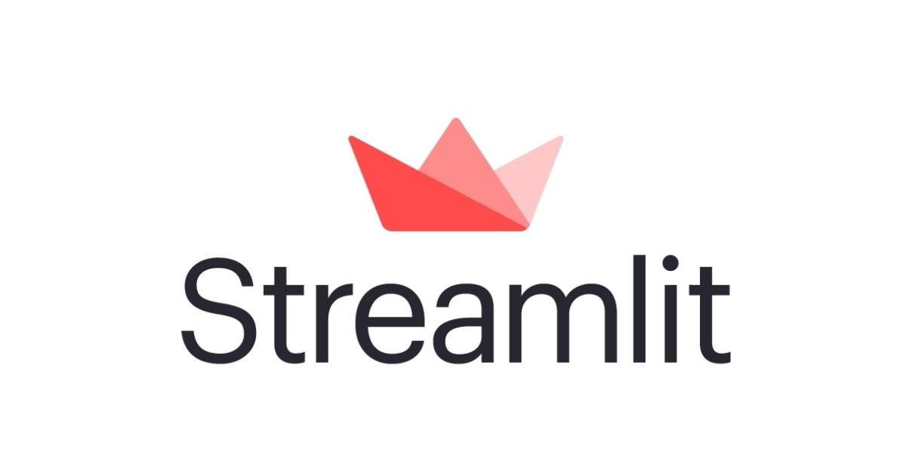

# AI Interview Chatbot
## Table of Content

- Overview
- Technical Aspect
- Installation
- Technologies Used

## Overview
This project is an Interview Chatbot created using OpenAI's GPT-3.5 and the Streamlit framework. The chatbot generates general or job-specific interview questions by just changing on line and evaluates the candidate's responses. This is achieved using a sequence of prompts that leverage the language model's capabilities in creating questions and evaluating responses.

## Technical Aspect
The Interview Chatbot project is primarily divided into two parts:

1. The generation of general or job-specific interview questions.
2. Evaluation of the candidate's responses to the questions.

Both tasks are accomplished using OpenAI's GPT-3.5 language model. The project uses Streamlit to create a simple and user-friendly web interface for the chatbot.

## Installation
Windows:
```bash
python3.8 -m venv myenv
myenv\Scripts\activate
pip install -r requirements.txt
export OPENAI_API_KEY=<your secret key>
streamlit run chatbot.py
```
Remember to replace `<your secret key>` with your actual OpenAI API Key.
## Technologies Used

 
